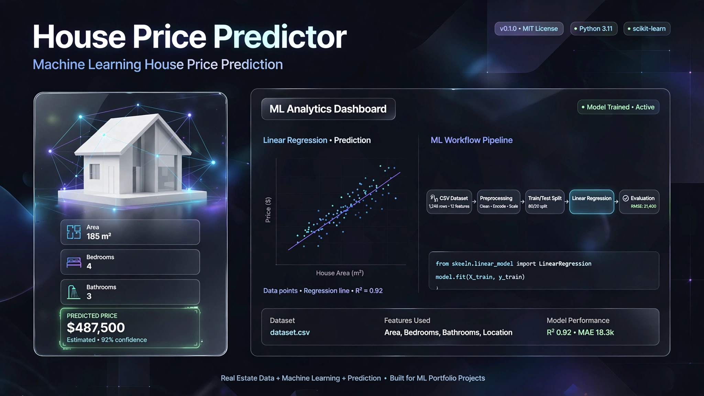

  

<h1 align="center">🏠 House Price Predictor</h1>

  A beginner-friendly Machine Learning project for predicting house prices from basic property features.

  
  
  
  
  

⸻

📌 Overview

House Price Predictor is a beginner-friendly Machine Learning project built with Python and Scikit-learn.

The project uses three basic property features to predict a house price:

* 📐 Area — house area in square meters
* 🛏️ Bedrooms — number of bedrooms
* 🛁 Bathrooms — number of bathrooms

A Linear Regression model is trained to learn the relationship between these features and the target house price.

⚠️ Learning Project: The current dataset is a small synthetic dataset created for learning purposes. The predictions should not be considered real-world property valuations.

⸻

✨ Features

* 📥 Load house price data from CSV
* 🧹 Clean and prepare the dataset
* ✂️ Split data into training and testing sets
* 🤖 Train a Linear Regression model
* 📊 Evaluate the model with MAE and R²
* 💾 Save the trained model with Joblib
* 🔮 Predict the price of a new house
* ⚙️ Automated training with GitHub Actions

⸻

🧠 Machine Learning Workflow

House Price Dataset
        ↓
Data Loading
        ↓
Data Cleaning
        ↓
Feature Selection
        ↓
Train / Test Split
        ↓
Linear Regression
        ↓
Model Evaluation
        ↓
Save Trained Model
        ↓
New House Input
        ↓
Price Prediction

⸻

📊 Features Used by the Model

Feature	Description
area	House area in square meters
bedrooms	Number of bedrooms
bathrooms	Number of bathrooms
price	Target house price

⸻

🛠️ Technologies

Technology	Purpose
Python	Programming language
Pandas	Data loading and cleaning
Scikit-learn	Machine Learning
Linear Regression	Prediction algorithm
Joblib	Model persistence
Git	Version control
GitHub	Repository hosting
GitHub Actions	Automated workflow

⸻

📂 Project Structure

House-Price-Predictor/
│
├── assets/
│   └── house-price-predictor-banner.png
│
├── data/
│   └── house_prices.csv
│
├── models/
│
├── src/
│   ├── preprocess.py
│   ├── train.py
│   └── predict.py
│
├── .github/
│   └── workflows/
│
├── requirements.txt
├── README.md
└── .gitignore

⸻

⚙️ Installation

1. Clone the repository

git clone https://github.com/Yassir050/House-Price-Predictor.git
cd House-Price-Predictor

2. Install dependencies

pip install -r requirements.txt

⸻

🚀 Train the Model

Run:

python src/train.py

The training process:

1. Loads the dataset
2. Cleans the data
3. Selects the features
4. Splits the data
5. Trains the Linear Regression model
6. Evaluates the model
7. Saves the trained model

The trained model is saved as:

models/house_price_model.pkl

⸻

🔮 Make a Prediction

After training the model, run:

python src/predict.py

The program asks for:

Area (m²)
Number of bedrooms
Number of bathrooms

It then uses the trained model to generate a predicted price.

⸻

📊 Model Evaluation

The project uses two evaluation metrics.

MAE — Mean Absolute Error

Mean Absolute Error measures the average absolute difference between predicted values and actual values.

A lower MAE generally indicates smaller prediction errors.

R² Score

R² Score measures how much of the variation in the target values is explained by the model.

A value closer to 1 generally indicates a better fit, although the metric must be interpreted together with the dataset and evaluation setup.

⸻

🤖 GitHub Actions

The project uses GitHub Actions to automatically run the training workflow when changes are pushed to the main branch.

The workflow provides practical experience with:

* Continuous Integration
* Automated Python workflows
* Dependency installation
* Automated model training
* Reproducible project execution

CI Workflow

Push to main
     ↓
Checkout Repository
     ↓
Set up Python
     ↓
Install Dependencies
     ↓
Run Training Script
     ↓
Evaluate Model
     ↓
Save Model

⸻

📚 Skills Practiced

This project provided practical experience with:

* 🐍 Python
* 🐼 Pandas
* 🧹 Data Cleaning
* 📊 Data Preparation
* 🤖 Machine Learning
* 📈 Linear Regression
* ✂️ Train/Test Split
* 📏 MAE
* 📐 R² Score
* 💾 Model Persistence
* 📦 Joblib
* 🔧 Git & GitHub
* ⚙️ GitHub Actions
* 🔄 Basic ML Workflow

⸻

🎯 Project Goal

The goal of this project is to understand the basic Machine Learning pipeline:

Data
 ↓
Preprocessing
 ↓
Features & Target
 ↓
Training
 ↓
Evaluation
 ↓
Model Persistence
 ↓
Prediction

It serves as an introduction to building a complete, structured Machine Learning project rather than working with a model in isolation.

⸻

⚠️ Limitations

The current version has several limitations:

* Small dataset
* Synthetic training data
* Only three features
* Simple Linear Regression model
* No real-world market data
* No advanced feature engineering
* No cross-validation

Therefore, the model is intended for educational purposes, not real estate decision-making.

⸻

🔮 Future Improvements

Possible future improvements include:

* 📊 Larger real-world dataset
* 🧹 Advanced data preprocessing
* 🏙️ Location features
* 📐 Additional property features
* 🔄 Cross-validation
* 🤖 Comparison with other ML algorithms
* 📈 Visualization and error analysis
* 🌐 Prediction API
* 🖥️ Web interface
* 🗄️ Database integration
* 🚀 Production deployment

⸻

👨‍💻 Author

Yassir.B

GitHub:

https://github.com/Yassir050

⸻

📄 License

This project is created for learning and portfolio purposes.

⸻

  🏠 Built to practice Machine Learning from data to prediction.

